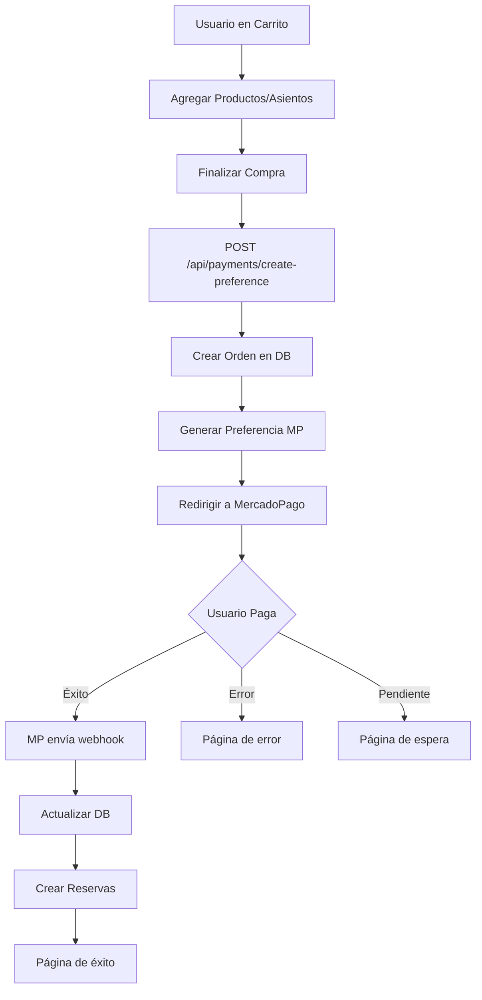

# 🛒 Configuración de MercadoPago - Puff & Chill

## 📋 Resumen

Esta guía te ayudará a configurar MercadoPago para el sistema de pagos del CineClub Puff & Chill. El sistema permite:

- ✅ Checkout unificado desde el carrito global
- ✅ Productos y asientos reservados en un solo pago
- ✅ Descuentos automáticos por membresía
- ✅ Webhooks para actualización automática de estados
- ✅ Páginas de resultado personalizadas

## 🔧 Configuración Inicial

### 1. Obtener Credenciales de MercadoPago

1. **Registrarse en MercadoPago**
   - Ve a [https://developers.mercadopago.com/](https://developers.mercadopago.com/)
   - Crea una cuenta de desarrollador

2. **Crear una Aplicación**
   - En el panel de desarrollador, crea una nueva aplicación
   - Selecciona "Checkout Pro" como producto

3. **Obtener las Credenciales**
   ```bash
   # Credenciales de TESTING (para desarrollo)
   MP_PUBLIC_KEY=TEST-xxxxxxxx-xxxx-xxxx-xxxx-xxxxxxxxxxxx
   MP_ACCESS_TOKEN=TEST-xxxxxxxxxxxxxxxxxxxxxxxxxxxxxxxxxxxxxxxx
   
   # Credenciales de PRODUCCIÓN (para deploy)
   MP_PUBLIC_KEY=APP_USR-xxxxxxxx-xxxx-xxxx-xxxx-xxxxxxxxxxxx
   MP_ACCESS_TOKEN=APP_USR-xxxxxxxxxxxxxxxxxxxxxxxxxxxxxxxxxxxxxxxx
   ```

### 2. Variables de Entorno

Crea un archivo `.env.local` con las siguientes variables:

```env
# MercadoPago
MP_PUBLIC_KEY=tu_public_key_aqui
MP_ACCESS_TOKEN=tu_access_token_aqui

# NextAuth (necesario para los redirects)
NEXTAUTH_URL=http://localhost:3000
NEXTAUTH_SECRET=tu_secret_muy_seguro_aqui

# Base de datos
DATABASE_URL=tu_url_de_base_de_datos
```

### 3. Configurar Webhooks

1. **En el Panel de MercadoPago:**
   - Ve a "Configuración" → "Webhooks"
   - Agrega la URL: `https://tu-dominio.com/api/payments/webhook`
   - Selecciona los eventos: `payment`

2. **Para desarrollo local (usando ngrok):**
   ```bash
   # Instalar ngrok
   npm install -g ngrok
   
   # Exponer puerto local
   ngrok http 3000
   
   # Usar la URL generada para el webhook
   # Ejemplo: https://abc123.ngrok.io/api/payments/webhook
   ```

## 🚀 Testing

### Tarjetas de Prueba para Argentina

```javascript
// Tarjeta aprobada
{
  cardNumber: '4509 9535 6623 3704',
  expiryDate: '11/25',
  cvv: '123',
  name: 'APRO'
}

// Tarjeta rechazada por fondos insuficientes
{
  cardNumber: '4013 5406 8274 6260',
  expiryDate: '11/25', 
  cvv: '123',
  name: 'FUND'
}

// Tarjeta rechazada por datos inválidos
{
  cardNumber: '4389 3540 6862 7426',
  expiryDate: '11/25',
  cvv: '123', 
  name: 'FORM'
}
```

### Usuarios de Prueba

```javascript
// Vendedor (tu aplicación)
{
  email: 'test_user_123456@testuser.com',
  password: 'qatest123'
}

// Comprador
{
  email: 'test_user_654321@testuser.com', 
  password: 'qatest123'
}
```

## 🔄 Flujo de Pago Implementado



## 📊 Estructura de Base de Datos

### Orders
```sql
-- Orden principal
{
  id: string
  userId: string  
  status: 'cart' | 'pending' | 'completed' | 'cancelled'
  subtotal: number
  discount: number
  total: number
  externalReference: string
  createdAt: DateTime
}
```

### OrderItems
```sql
-- Items de la orden
{
  id: string
  orderId: string
  productId: string (nullable para seats)
  quantity: number
  price: number
  metadata: string (JSON para seats)
}
```

### Payments
```sql
-- Registro de pagos
{
  id: string
  orderId: string
  amount: number
  status: 'pending' | 'completed' | 'failed' | 'refunded'
  providerPaymentId: string
  providerResponse: string (JSON)
  createdAt: DateTime
}
```

## 🎯 Funcionalidades Principales

### 1. Carrito Global Unificado
- **Context de React** para estado global
- **LocalStorage** para persistencia
- **Productos y Asientos** en un solo carrito
- **Expiracion automática** de reservas (15 min)

### 2. Descuentos por Membresía
```javascript
const discounts = {
  'Bronce': 5,   // 5%
  'Plata': 10,   // 10% 
  'Oro': 15      // 15%
}
```

### 3. Navegación Integrada
- **Botón en Navigation** con contador de items
- **Sidebar desplegable** con Framer Motion
- **Accesible desde cualquier página**

### 4. Checkout Seguro
- **Validación** de items y stock
- **Creación de preferencia** con datos completos
- **Redirect automático** a MercadoPago
- **Manejo de errores** con páginas personalizadas

## 🔒 Seguridad

### Validaciones Implementadas
- ✅ Autenticación obligatoria
- ✅ Verificación de ownership de órdenes
- ✅ Validación de stock antes de checkout
- ✅ Timeout en reservas de asientos
- ✅ Verificación de webhooks de MP

### Headers de Seguridad
```javascript
// En el webhook, agregar validación de firma
const isValidWebhook = validateMPSignature(
  body, 
  headers['x-signature'],
  process.env.MP_WEBHOOK_SECRET
)
```

## 🚀 Deployment

### Vercel (Recomendado)
1. **Variables de entorno en Vercel:**
   ```bash
   vercel env add MP_PUBLIC_KEY
   vercel env add MP_ACCESS_TOKEN
   vercel env add NEXTAUTH_URL
   ```

2. **Configurar Webhook en producción:**
   - URL: `https://tu-app.vercel.app/api/payments/webhook`
   - Eventos: `payment`

### Railway/Heroku
```bash
# Configurar variables
railway add MP_PUBLIC_KEY=tu_key
railway add MP_ACCESS_TOKEN=tu_token
```

## 🐛 Troubleshooting

### Problemas Comunes

1. **Error 400 en webhook**
   ```bash
   # Verificar que la URL sea accesible
   curl -X POST https://tu-app.com/api/payments/webhook \
     -H "Content-Type: application/json" \
     -d '{"type":"test"}'
   ```

2. **Preferencia no se crea**
   ```javascript
   // Verificar credenciales
   console.log('MP_ACCESS_TOKEN:', process.env.MP_ACCESS_TOKEN?.slice(0, 10))
   ```

3. **Redirect no funciona**
   ```javascript
   // Verificar NEXTAUTH_URL
   console.log('Base URL:', process.env.NEXTAUTH_URL)
   ```

### Logs Útiles
```javascript
// En el webhook
console.log('Payment notification:', {
  type: body.type,
  data: body.data,
  timestamp: new Date().toISOString()
})

// En create-preference
console.log('Creating preference for:', {
  orderId,
  userId: user.id,
  itemCount: mpItems.length,
  total: mpItems.reduce((sum, item) => sum + item.unit_price * item.quantity, 0)
})
```

## 📞 Soporte

### Enlaces Útiles
- [Documentación MercadoPago](https://www.mercadopago.com.ar/developers/es/docs)
- [Checkout Pro](https://www.mercadopago.com.ar/developers/es/docs/checkout-pro/landing)
- [Testing](https://www.mercadopago.com.ar/developers/es/docs/checkout-pro/test-integration)
- [Webhooks](https://www.mercadopago.com.ar/developers/es/docs/your-integrations/notifications/webhooks)

### Contacto
- Email: soporte@puffandchill.com
- Slack: #payments-support
- GitHub Issues: Para bugs técnicos

---

🎬 **¡Listo para recibir pagos en tu CineClub!** 🍿 